# 🏠 ServiHogar 2.0

> Plataforma móvil que conecta clientes con profesionales de servicios del hogar.

---

## 💡 Idea de Negocio

El mercado de servicios del hogar en Colombia carece de una plataforma digital confiable que conecte a clientes con profesionales de manera rápida y transparente.

**ServiHogar 2.0** busca solucionar esta necesidad mediante un marketplace móvil donde:

- Los **clientes** pueden buscar y solicitar servicios profesionales.
- Los **profesionales** pueden ofrecer sus servicios y gestionar las solicitudes recibidas.
- Los usuarios pueden interactuar de acuerdo con el rol asignado dentro de la aplicación.
- El sistema permite gestionar el proceso de solicitud y cotización de los servicios.
- Las actualizaciones de información permiten mantener informados a clientes y profesionales durante el proceso.

### Categorías de servicio disponibles

Plomería · Electricidad · Construcción · Pintura · Carpintería · Cerrajería · Jardinería · Limpieza · Gas · Climatización

---

## 📱 Capturas de Pantalla

### 🔐 Autenticación y acceso

| Inicio de sesión | Registro | Selección de rol |
|:---:|:---:|:---:|
| 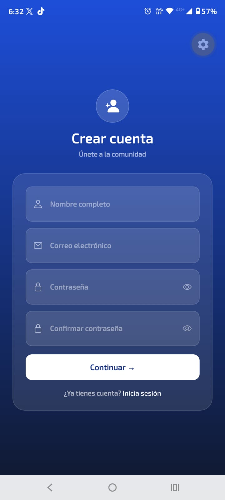 | 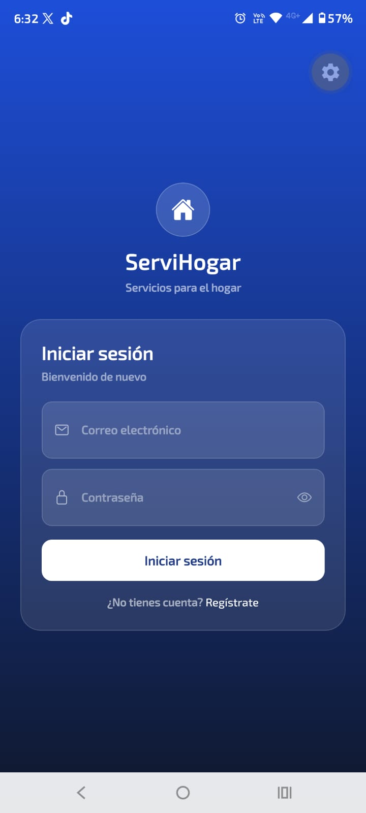 | 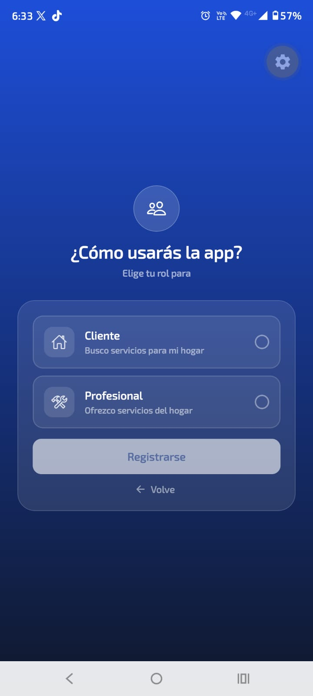 |

La aplicación permite registrar usuarios, seleccionar el rol correspondiente e iniciar sesión mediante Firebase Authentication.

### 📧 Verificación de correo electrónico

Durante el proceso de autenticación se realiza la verificación de la cuenta mediante el envío de un correo electrónico al usuario registrado.

| Envió correo electrónico | Confirmación correo electrónico |
|:---:|:---:|
| 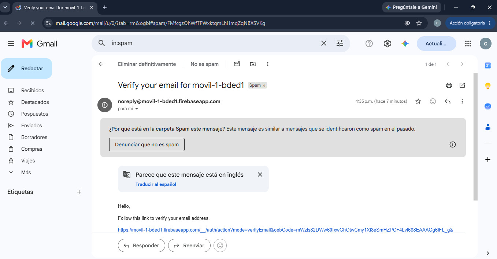 | 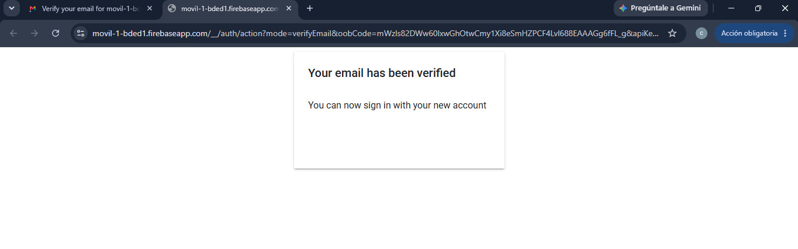 |

### 👤 Acceso según el tipo de usuario

La aplicación diferencia el flujo de navegación dependiendo del rol seleccionado.

| Splash Cliente | Splash Profesional |
|:---:|:---:|
| 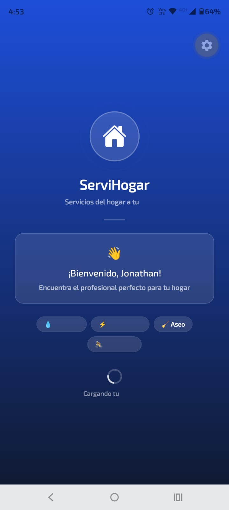 | 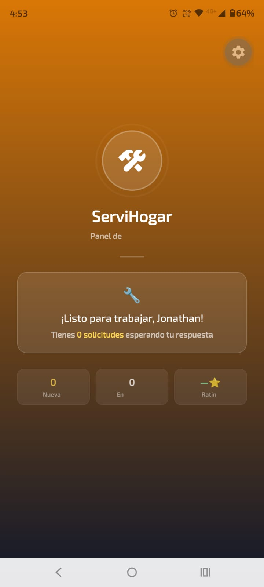 |

### 🏠 Vistas principales

| Vista principal del cliente | Vista principal del profesional |
|:---:|:---:|
| 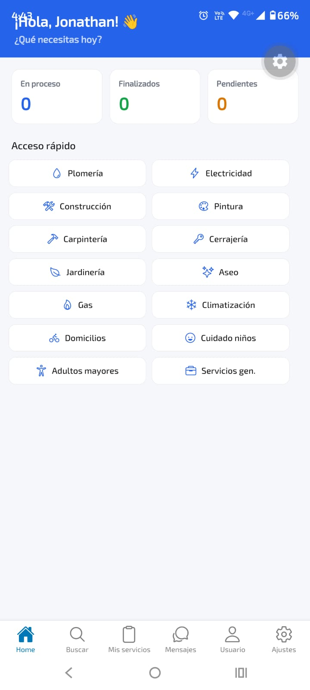 | 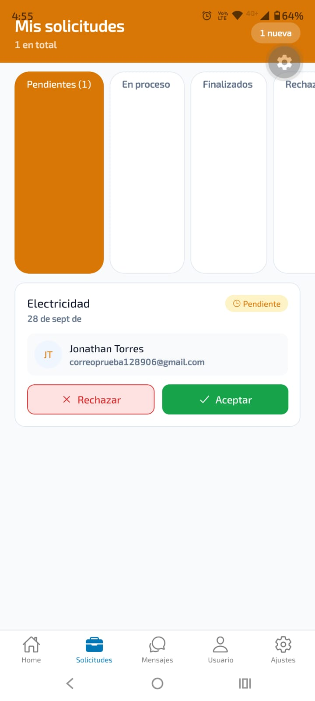 |

Cada perfil dispone de una vista principal adaptada a las funciones correspondientes a su rol.

### 🔎 Servicios y profesionales

| Buscar profesionales | Mis servicios |
|:---:|:---:|
| 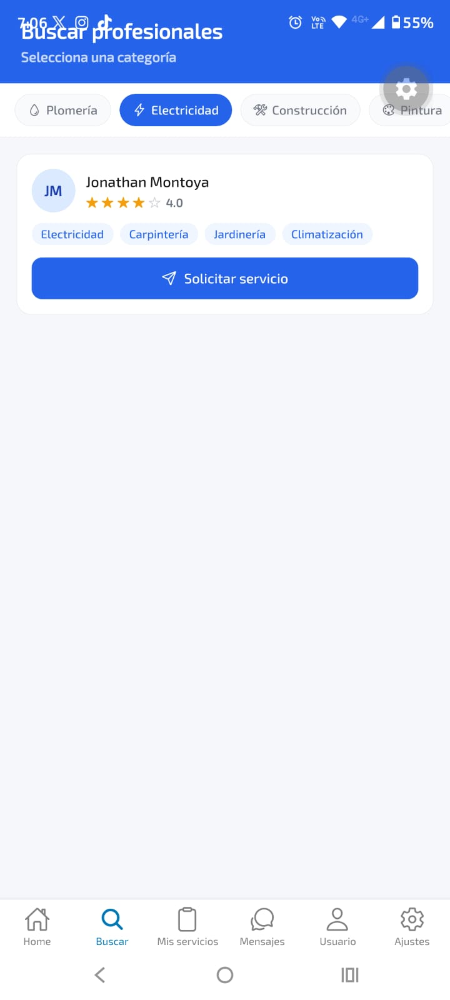 | 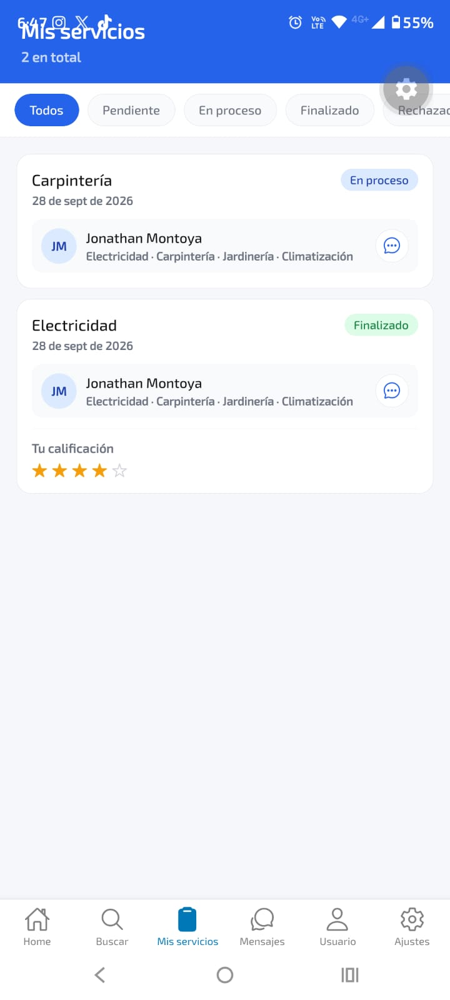 |

### 💰 Gestión de cotizaciones

El profesional puede enviar una cotización al cliente como parte del proceso de atención de una solicitud de servicio.
| Cotización del servicio |
|:---:|
| 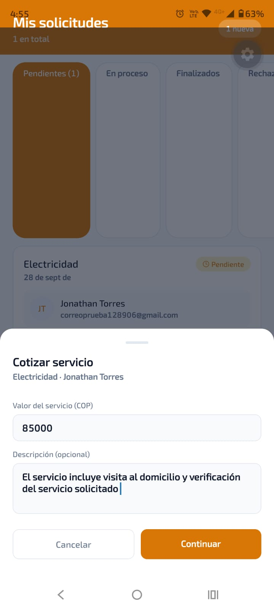 |

---

## 📊 Gestión del Proyecto

El desarrollo de **ServiHogar 2.0** fue realizado de manera individual. 
Git y GitHub fueron utilizados como herramientas de control de versiones 
para almacenar el código fuente, registrar los cambios y mantener la 
evolución del proyecto.

### 🗂️ Repositorio

El código fuente y los recursos del proyecto se encuentran disponibles en:

🔗 [Repositorio GitHub - ServiHogar 2.0](https://github.com/JhonnyTorres/ServiHogar2.0)

### 🌿 Ramas

Actualmente el repositorio cuenta con las siguientes ramas principales 
utilizadas durante el desarrollo:

- `main`: rama principal del proyecto.
- `proyectos`: rama utilizada para el desarrollo del proyecto.

### 💾 Control de versiones

Git y GitHub permitieron:

- Registrar los cambios realizados durante el desarrollo.
- Mantener un historial de modificaciones.
- Gestionar los archivos y recursos del proyecto.
- Mantener un respaldo remoto del código fuente.
- Recuperar versiones anteriores cuando fue necesario.

### 🔄 Evolución del proyecto

El historial de commits evidencia el desarrollo progresivo de la aplicación 
y la actualización de diferentes componentes del proyecto.

Entre los cambios registrados se encuentran modificaciones relacionadas con:

- Actualización de la documentación del proyecto.
- Incorporación de evidencias de verificación de correo electrónico.
- Organización y actualización de imágenes.
- Corrección de referencias a imágenes en el README.
- Documentación del envío de cotizaciones.
- Actualización de las evidencias de las funcionalidades.

### 📸 Evidencia del control de versiones

La siguiente captura muestra el historial de commits registrados en el 
repositorio de GitHub:

| Commits | Repositorio |
|---|---|
| 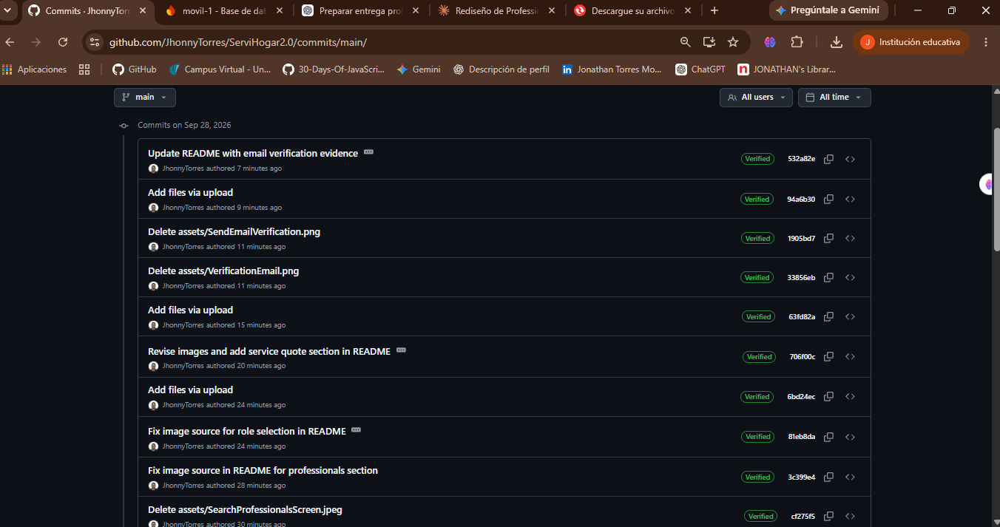 | 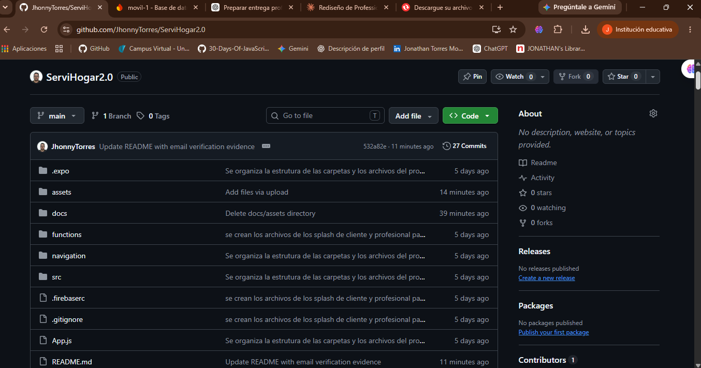 |

---

## 🛠️ Stack Tecnológico

| Tecnología | Uso |
|---|---|
| React Native + Expo | Framework principal de desarrollo móvil |
| Firebase Authentication | Autenticación y gestión de usuarios |
| Cloud Firestore | Base de datos en tiempo real |
| SQLite (`expo-sqlite`) | Persistencia local y almacenamiento de información |
| Cloudinary | Almacenamiento de imágenes de perfil |
| React Navigation | Navegación entre pantallas |
| Expo Notifications | Gestión de notificaciones |
| Expo Linear Gradient | Gradientes visuales en pantallas de autenticación |

---

## 🚀 Funcionalidades Implementadas

### 🔐 Autenticación

- [x] Registro de usuarios.
- [x] Registro con nombre, correo y contraseña.
- [x] Selección de rol: cliente / profesional.
- [x] Creación del perfil profesional.
- [x] Inicio de sesión.
- [x] Cierre de sesión.
- [x] Verificación de correo electrónico.
- [x] Navegación diferenciada según el rol del usuario.

### 👤 Cliente

- [x] Vista principal del cliente.
- [x] Acceso a categorías de servicios.
- [x] Búsqueda de profesionales por categoría.
- [x] Solicitud de servicios.
- [x] Confirmación de solicitudes.
- [x] Visualización de servicios.
- [x] Historial de servicios.
- [x] Visualización de cotizaciones enviadas por profesionales.
- [x] Calificación mediante estrellas y comentario.
- [x] Visualización de servicios rechazados.

### 👷 Profesional

- [x] Vista principal del profesional.
- [x] Visualización del estado del perfil.
- [x] Gestión de solicitudes recibidas.
- [x] Visualización de solicitudes en tiempo real.
- [x] Aceptación o rechazo de solicitudes.
- [x] Finalización de servicios.
- [x] Envío de cotizaciones al cliente.
- [x] Visualización del promedio de calificaciones.

### 💬 Comunicación y notificaciones

- [x] Gestión de información de usuarios mediante Firestore.
- [x] Gestión de notificaciones asociadas a eventos de la aplicación.
- [x] Actualización de información de usuarios en tiempo real.

### 👤 Perfil y configuración

- [x] Gestión de información del perfil.
- [x] Gestión de foto de perfil mediante Cloudinary.
- [x] Configuración de usuario.
- [x] Cierre de sesión.

### 💾 Persistencia local

- [x] Caché de servicios del cliente.
- [x] Historial de búsquedas recientes por categoría.
- [x] Registro de profesionales vistos recientemente.

---

## 📸 Evidencias de funcionamiento

Las evidencias de la aplicación incluyen los siguientes flujos:

### Flujo de autenticación

1. Registro del usuario.
2. Selección del rol.
3. Verificación del correo electrónico.
4. Inicio de sesión.
5. Redirección según el rol seleccionado.

### Flujo del cliente

1. Inicio de sesión como cliente.
2. Visualización de la pantalla principal.
3. Búsqueda de profesionales.
4. Gestión de servicios.
5. Recepción y visualización de cotizaciones.

### Flujo del profesional

1. Inicio de sesión como profesional.
2. Visualización de la pantalla principal.
3. Gestión de solicitudes.
4. Elaboración y envío de cotización al cliente.

---

## 📁 Estructura del Proyecto

```text
ServiHogar2.0/
├── navigation/
│   ├── AppNavigator.js
│   ├── AuthContext.js
│   └── AppProvider.js
│
├── src/
│   ├── screens/
│   │   ├── auth/
│   │   │   ├── LoginScreen.js
│   │   │   ├── RegisterScreen.js
│   │   │   ├── RoleSelectionScreen.js
│   │   │   └── ProfessionalProfileScreen.js
│   │   │
│   │   ├── HomeScreen.js
│   │   ├── SearchProfessionalsScreen.js
│   │   ├── ClientServicesScreen.js
│   │   ├── ProfessionalServicesScreen.js
│   │   ├── UserScreen.js
│   │   ├── SettingsScreen.js
│   │   ├── SplashClientScreen.js
│   │   └── SplashProScreen.js
│   │
│   ├── services/
│   │   ├── firebaseService.js
│   │   ├── cloudinaryService.js
│   │   ├── sqliteService.js
│   │   ├── userService.js
│   │   ├── ChatService.js
│   │   └── NotificationService.js
│   │
│   └── constants/
│       └── colors.js
│
├── functions/
│   └── notificaciones.js
│
├── docs/
│   ├── ManualTecnico_ServiHogar.docx
│   └── ManualUsuario_ServiHogar.docx
│
├── assets/
├── App.js
├── package.json
└── README.md
## 👨‍💻 Autor

Desarrollado como proyecto de aula para la materia de **Desarrollo Móvil** — Universidad Católica Luis Amigó.
## 📸 Evidencias

